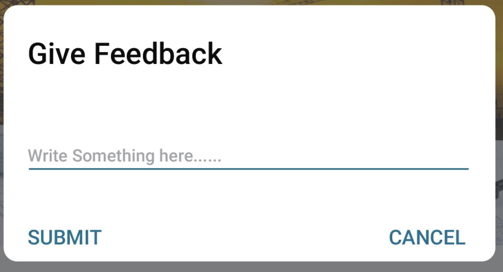

# Android 

## ListView nested inside ScrollView showing only one item
Call this method with the listview as parameter after setting the adapter. 
```
public static void setListViewHeightBasedOnChildren(ListView listView) {
        BaseAdapter listAdapter = (BaseAdapter) listView.getAdapter();
        if (listAdapter == null) {
            // pre-condition
            return;
        }

        int totalHeight = 0;
        Log.d("UIU-965", listAdapter.getCount() + "");
        for (int i = 0; i < listAdapter.getCount(); i++) {
            View listItem = listAdapter.getView(i, null, listView);
            listItem.measure(0, 0);
            totalHeight += listItem.getMeasuredHeight();
        }

        ViewGroup.LayoutParams params = listView.getLayoutParams();
        params.height = totalHeight + (listView.getDividerHeight() * (listAdapter.getCount() - 1));
        listView.setLayoutParams(params);
        listView.requestLayout();
    }
```

## ALertDialog with curved edge

XML file:
```
<?xml version="1.0" encoding="utf-8"?>
<LinearLayout xmlns:android="http://schemas.android.com/apk/res/android"
    xmlns:app="http://schemas.android.com/apk/res-auto"
    android:layout_width="match_parent"
    android:layout_height="match_parent"
    android:background="@drawable/cornered_white_bg"
    android:orientation="vertical"
    android:padding="10dp">

    <TextView
        android:layout_width="match_parent"
        android:layout_height="wrap_content"
        android:layout_gravity="center"
        android:layout_marginStart="5dp"
        android:text="Give Feedback"
        android:textColor="@color/black"
        android:textSize="18sp"
        android:textStyle="bold" />


    <TextView
        android:id="@+id/warning"
        android:layout_width="match_parent"
        android:layout_height="wrap_content"
        android:layout_gravity="center"
        android:layout_marginStart="5dp"
        android:layout_marginTop="25dp"
        android:textColor="@color/ABpos"
        android:textSize="12sp"
        android:textStyle="normal" />

    <android.support.v7.widget.AppCompatEditText
        android:id="@+id/et_feedback"
        android:layout_width="match_parent"
        android:layout_height="wrap_content"
        android:layout_marginStart="5dp"
        android:layout_marginEnd="10dp"
        android:layout_marginBottom="10dp"
        android:gravity="bottom"
        android:hint="Write something here......."
        android:padding="12dp"
        android:singleLine="true"
        android:textSize="14sp"
        app:backgroundTint="@color/colorPrimary" />

    <LinearLayout
        android:layout_width="match_parent"
        android:layout_height="wrap_content"
        android:layout_marginTop="10dp"
        android:layout_marginBottom="12dp"
        android:orientation="horizontal">

        <TextView
            android:id="@+id/btn_feedback"
            android:layout_width="0dp"
            android:layout_height="wrap_content"
            android:layout_gravity="center"
            android:layout_marginStart="5dp"
            android:layout_weight="1"
            android:text="SUBMIT"
            android:textColor="@color/colorPrimary"
            android:textSize="14sp"
            android:textStyle="bold" />

        <TextView
            android:id="@+id/btnCancel"
            android:layout_width="wrap_content"
            android:layout_height="wrap_content"
            android:layout_gravity="center"
            android:layout_marginStart="5dp"
            android:layout_marginEnd="5dp"
            android:text="CANCEL"
            android:textColor="@color/colorPrimary"
            android:textSize="14sp"
            android:textStyle="bold" />
    </LinearLayout>
</LinearLayout>

```
Activity.java
```
AlertDialog.Builder mBuilder = new AlertDialog.Builder(MainActivity.this);
View mView = getLayoutInflater().inflate(R.layout.feedback_dialog, null);
mBuilder.setView(mView);
final AlertDialog dialog = mBuilder.create();
dialog.getWindow().setBackgroundDrawable(new ColorDrawable(Color.TRANSPARENT));
dialog.show();
```


## Circular shape (mostly for background)
Required files:
- <a href="circle.xml" target="_blank">drawable/circle.xml</a>

Usage:
```
<RelativeLayout
            android:layout_gravity="center_vertical"
            android:layout_width="wrap_content"
            android:layout_height="wrap_content">

            <ImageView
                android:background="@drawable/call_background_circle"
                android:layout_width="48dp"
                android:padding="5dp"
                android:src="@drawable/ic_action_phone_in_talk"
                android:layout_height="48dp"/>


</RelativeLayout>
```
Output: <br />


## Programmatically change colors of StateListDrawable
Ref: [Stack Overflow- How can I change colors in my StateListDrawable?](https://stackoverflow.com/questions/19864337/how-can-i-change-colors-in-my-statelistdrawable) <br />
button_main.xml (main layout)
```
<RelativeLayout

            android:layout_marginEnd="10dp"
            android:layout_gravity="center_vertical"
            android:layout_width="wrap_content"
            android:layout_height="wrap_content">

            <ImageView
                android:id="@+id/make_call"
                android:background="@drawable/call_background_circle"
                android:layout_width="48dp"
                android:padding="5dp"
                android:src="@drawable/ic_action_phone_in_talk"
                android:layout_height="48dp"/>


        </RelativeLayout>
```
background_circle.xml (drawable)
```
<?xml version="1.0" encoding="utf-8"?>
<selector xmlns:android="http://schemas.android.com/apk/res/android">
    <item>
        <shape android:shape="oval">
            <solid android:color="#00FF00"/> # this is what we want to change
            <size

                android:height="120dp"
                android:width="120dp"/>
        </shape>
    </item>

</selector>
```
Code for changing background color
```
ImageView callImageView = (ImageView) convertView.findViewById(R.id.make_call);
        StateListDrawable backgroundDrawable = (StateListDrawable) callImageView.getBackground();
        DrawableContainer.DrawableContainerState drawableContainerState = (DrawableContainer.DrawableContainerState) backgroundDrawable.getConstantState();
        Drawable[] children = drawableContainerState.getChildren();
        GradientDrawable firstItem =  (GradientDrawable) children[0];
        firstItem.getDrawable(0);
        firstItem.setColor(magnitudeColor); // magnitudeColor is int 
```

## Properly showing CardView inside a ListView
ListView code fragment
```
<ListView
    android:id="@+id/list"
    android:orientation="vertical"
    android:layout_width="match_parent"
    android:layout_height="match_parent"
    android:divider="@android:color/transparent"
    android:dividerHeight="10.0sp"/>
```
List item
```
<android.support.v7.widget.CardView
    xmlns:android="http://schemas.android.com/apk/res/android"
    xmlns:app="http://schemas.android.com/apk/res-auto"
    xmlns:tools="http://schemas.android.com/tools"
    xmlns:card_view="http://schemas.android.com/apk/res-auto"
    android:layout_width="match_parent"
    android:layout_height="wrap_content"
    card_view:cardBackgroundColor="#E6E6E6"
    card_view:cardCornerRadius="8dp"
    card_view:cardElevation="8dp">

<LinearLayout
    android:background="#F3EEEE"
    android:layout_width="match_parent"
    android:layout_height="match_parent"
    android:orientation="horizontal">

            .....
            .....
            .....
</LinearLayout>
</android.support.v7.widget.CardView>
```


## Volley
Latest release: https://github.com/google/volley/releases <br />
