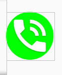

# Android 
## Circular shape (mostly for background)
Required files:
- [drawable/circle.xml](circle.xml)

Usage:
```
<RelativeLayout
            android:layout_gravity="center_vertical"
            android:layout_width="wrap_content"
            android:layout_height="wrap_content">

            <ImageView
                android:background="@drawable/call_background_circle"
                android:layout_width="48dp"
                android:padding="5dp"
                android:src="@drawable/ic_action_phone_in_talk"
                android:layout_height="48dp"/>


</RelativeLayout>
```
Output: <br />
